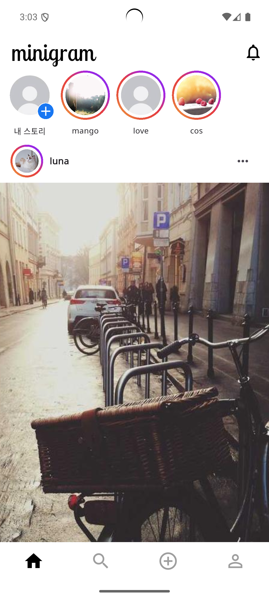
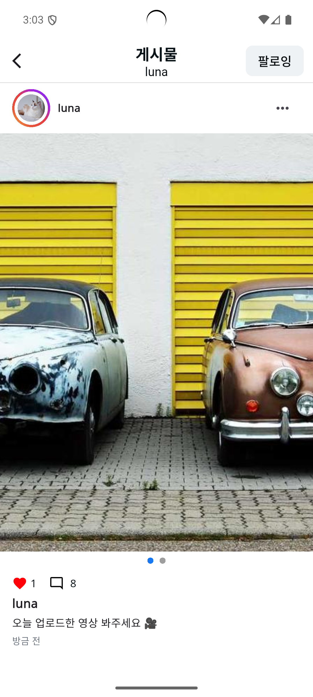
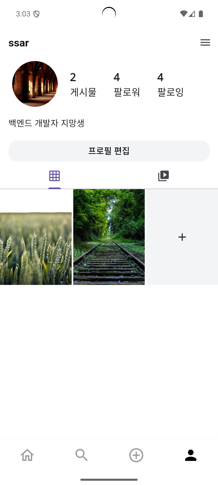

# 실무양성심화과정 - 중개플랫폼 웹/앱 : Minigram

- 마지막 팀 프로젝트이므로 새롭고 화려한 기능 구현 보다 실제 취업에 도움이 되는 학습 및 기술 재정비에 초점을 맞춤
- 프로젝트에만 시간을 투자하기보다, 지금 시점에서는 입사 지원과 면접 준비와의 병행을 고려해 처음부터 새로운 앱을 디자인하기보다는 참고할 만한 서비스의 클론을 선택
- 팀원들 상황을 고려했을 때, 최근에 Flutter로만 프로젝트를 진행하여 Spring을 오래 안했던 사람은 Spring 감각을 되찾고, Flutter를 처음 해보는 사람은
  Flutter 학습을 할 수 있는 기술 재정비 및 학습을 목표로 함

- 전체 개발 기간 : 2025.08.28 ~ 2025.09.18
   

## 🎥 시연영상

<video src="https://github.com/user-attachments/assets/6a5c01fc-dfd8-4b84-88ea-97e4eef41afd" controls width="600"></video>

## 앱 클론

- 인스타그램을 클론코딩하여 제작하였습니다.

# 👥 팀 멤버

| 이름   | 역할 | GitHub                                 |
| ------ | ---- | -------------------------------------- |
| 김주희 | 팀장 | [@jh0804](https://github.com/jh0804)   |
| 최재원 | 팀원 | [@jjack-1](https://github.com/jjack-1) |
| 김정원 | 팀원 | [@hahamik](https://github.com/hahamik) |

 

# ⚙️ 기술 스택

## 🛠️ 사용 기술

<table>
  <tr>
    <td align="center">
       
      Dart
    </td>
    <td align="center">
       
      Flutter
    </td>
    <td align="center">
       
      Riverpod
    </td>
    <td align="center">
       
      Dio
    </td>
    <td align="center">
       
      SSE
    </td>
  </tr>
</table>

## 🧰 개발 환경

<table>
  <tr>
    <td align="center">
       
      Android Studio
    </td>
    <td align="center">
       
      Cursor
    </td>
  </tr>
</table>

## 🤝 협업 도구

<table>
    <tr>
        <td align="center"> Git</td>
        <td align="center"> GitHub</td>
        <td align="center"> Notion</td>
        <td align="center"> Slack</td>
    </tr>
</table>

 

# 📋 프로젝트 업무 분담

<table style="width: 100%; text-align: start; font-size: 16px; border-collapse: collapse;">
    <thead style="background-color: #f2f2f2;">
        <tr>
            <th style="padding: 10px; border: 1px solid #ddd;">담당자</th>
            <th style="padding: 10px; border: 1px solid #ddd;">프로젝트 업무 분담</th>
        </tr>
    </thead>
    <tbody>
        <tr>
            <td style="padding: 10px; border: 1px solid #ddd;">김주희</td>
            <td style="padding: 10px; border: 1px solid #ddd;">
                <ul>
                    <li>프로젝트 계획 및 관리</li>
                    <li>팀 리딩 및 커뮤니케이션</li>
                    <li>좋아요, 댓글 알림</li>
                </ul>
            </td>
        </tr>
        <tr>
            <td style="padding: 10px; border: 1px solid #ddd;">최재원</td>
            <td style="padding: 10px; border: 1px solid #ddd;">
                <ul>
                    <li>공통 사용 위젯 작성</li>
                    <li>회원가입</li>
                    <li>로그인</li>
                    <li>게시글 검색 화면</li>
                    <li>유저 프로필 화면</li>
                    <li>메인 화면</li>
                </ul>
            </td>
        </tr>
        <tr>
            <td style="padding: 10px; border: 1px solid #ddd;">김정원</td>
            <td style="padding: 10px; border: 1px solid #ddd;">
                <ul>
                    <li>공통 색상 작성</li>
                    <li>공통 사이즈 작성</li>
                    <li>공통 테마 설정</li>
                    <li>게시글 상세 화면</li>
                    <li>스토리 상세 화면</li>
                    <li>게시글 등록</li>
                    <li>스토리 등록</li>
                    <li>댓글 화면</li>
                    <li>알림 화면</li>
                </ul>
            </td>
        </tr>
    </tbody>
</table>

# 주요 기능

### 공통

- 로그인, 회원가입
- 유효성 검사

### 게시글

- 사진과 내용을 등록
- 한번에 최대 5개의 사진 등록 가능
- 내용 수정 가능
- 삭제 가능
- 게시글 좋아요 가능

### 스토리

- 영상을 등록
- 한번에 최대 1개의 영상 등록 가능
- 삭제 가능
- 스토리 좋아요 가능

### 댓글

- 댓글 목록, 등록, 삭제
- 대댓글 작성 가능

### 팔로잉

- 팔로잉 목록, 등록, 삭제
- 팔로잉 유저 목록

### 검색

- 게시글 내용으로 검색

### 유저 페이지

- 유저의 상세 정보 확인
- 유저의 닉네임, 자기소개 변경 가능

### 알림

- 댓글 알림
- 게시글 좋아요 알림
- 댓글 좋아요 알림
- 스토리 좋아요 알림
